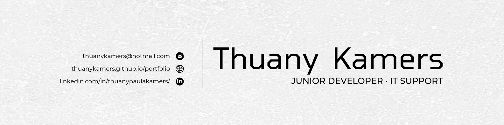
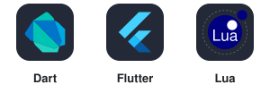

  

## Tech Stack

### Frontend

### Backend

### Mobile

### Databases

### Tools & DevOps

### Enterprise & IT Systems

      

## Cybersecurity

**Cybersecurity Fundamentals** | IBM SkillsBuild

## Currently

- Studying cybersecurity
- Looking for an IT role in Europe

## Contact

**Portfolio:** https://thuanykamers.github.io/portfolio/

