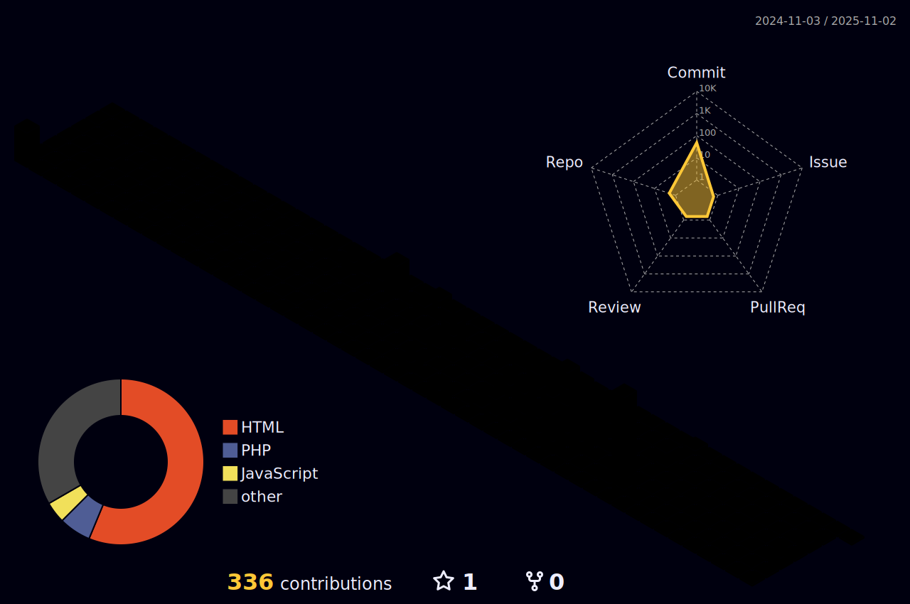

  

### Hi! I'm Thuany! 😊

## Tech Stack

 
  
  
  
  
  
  
  
  
  
  
  

 

Software developer intern.
Currently pursuing a Bachelor's degree in Information Systems and an associate's degree in Systems Analysis and Development. I'm actively dedicated to self-learning various programming languages.

